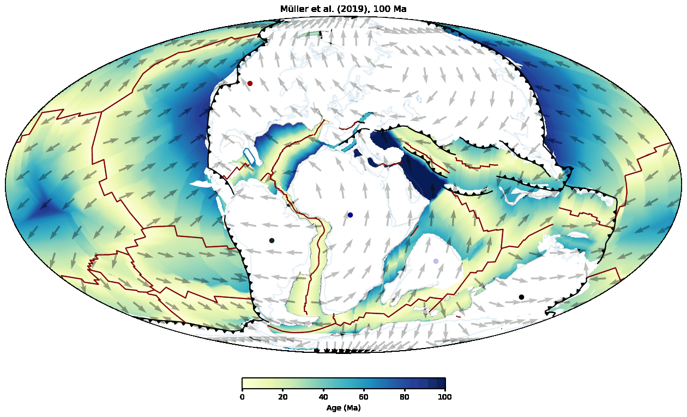

# GPlately

GPlately is an object-oriented interface to common pyGPlates and PlateTectonicTools routines.

___This repository is under active developement and the API is liable to change!___

## Dependencies

- [pyGPlates](https://www.gplates.org/docs/pygplates/pygplates_getting_started.html#installation)
- [PlateTectonicTools](https://github.com/EarthByte/PlateTectonicTools)
- [Shapely](https://shapely.readthedocs.io/en/stable/project.html#installing-shapely)
- NumPy
- SciPy
- Matplotlib
- [Cartopy](https://scitools.org.uk/cartopy/docs/latest/index.html#getting-started) (for mapping)
- Shapely
- [Pooch](https://github.com/fatiando/pooch)
- GeoPandas
- netCDF4


## Installation

You can install `GPlately` using the pip package manager,

```python
pip3 install --user gplately
```

... you can also install the most updated version of the `GPlately` repository with pip:

```python
pip install git+https://github.com/GPlates/gplately.git 
```


## Usage

GPlately uses objects to accomplish a variety of common tasks. The common objects include:

- `DataServer` - download rotation files and topology features from plate models on EarthByte's webDAV server
- `PlateReconstruction` - reconstruct features, tesselate mid ocean ridges, subduction zones
- `Points` - partition points onto plates, rotate back through time
- `Raster` - read in NetCDF grids, interpolation, resampling
- `PlotTopologies` - one stop shop for plotting ridges, trenches, subduction teeth


### The `DataServer` object

`GPlately`'s `DataServer` object can be used to download:

- rotation models
- topology features
- static polygons
- coastlines
- continents
- continent-ocean boundaries
- age grids and rasters
- geological feature data

from assorted plate reconstruction models. These files are needed to construct most of `GPlately`'s objects. For example,
we can download a `rotation model`, a set of `topology features` and some `static polygons` from the [Müller et al. 2019](https://www.earthbyte.org/muller-et-al-2019-deforming-plate-reconstruction-and-seafloor-age-grids-tectonics/) 
global Mesozoic–Cenozoic deforming plate motion model. 

```python
gDownload = gplately.DataServer("Muller2019")
rotation_model, topology_features, static_polygons = gDownload.get_plate_reconstruction_files()
```

### The `PlateReconstruction` object

... contains methods to reconstruct the positions of present-day feature data back through geological time. You can also use
it to calculate plate model data like topological plate velocities, or total trench and ridge lengths per Ma! You can create
the object by passing a `rotation model`, a set of `topology features` and some `static polygons`: 

```python
model = gplately.PlateReconstruction(rotation_model, topology_features, static_polygons)
```
Launch the [Plate Reconstruction](./Notebooks/02-PlateReconstructions.ipynb) notebook to see more.


### The `PlotTopologies` object

... can be used to visualise reconstructed feature geometries through time. To call the object, pass a set of `continents`, 
`coastlines` and `COBs` (either as file paths or as `<pyGPlates.FeatureCollection>` objects), as well as a `PlateReconstruction`
object, and a reconstruction `time`. 

```python
coastlines, continents, COBs = gDownload.get_topology_geometries()
time = 50 #Ma
gPlot = gplately.plot.PlotTopologies(model, time, coastlines, continents, COBs)
```
Below is a plot containing continents, coastlines, COBs, ridges and transforms, trenches and subduction teeth and
seafloor age grids!


### The `Points` object

... can be used to reconstruct the positions of seed point data and calculate their underlying plates' velocities through 
geological time. 

```python
pt_lon = np.array([-107.662152, -58.082792, 17.483189, 133.674590, 80.412876])
pt_lat = np.array([48.797807, -12.654857, 11.884395, -26.415630, 31.368509])

# Call the Points object: pass the PlateReconstruction object, and the latitudes and longitudes of the seed points!
gpts = gplately.Points(model, pt_lon, pt_lat)
```



### The `Raster` object

...can be used to read, resample and resize assorted raster data like `netCDF4` seafloor age grids, continental grids and ETOPO
relief rasters. You can also reconstruct raster data back through geological time!

```python
time = 0
agegrid = gdownload.get_age_grid(time)
graster = gplately.Raster(model, array=agegrid, extent=[-180,180,-90,90])
```


## Sample workflows

To see GPlately in action, launch a Jupyter Notebook environment and check out the [sample notebooks](./Notebooks)!
